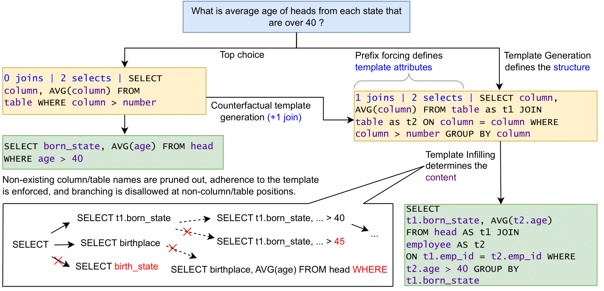

  

# AmbiQT and LogicalBeam

This repository contains the code and assets for the following paper, to appear at EMNLP 2023 (Main):

**Benchmarking and Improving Text-to-SQL Generation Under Ambiguity** 
*Adithya Bhaskar\*, Tushar Tomar\*, Ashutosh Sathe and Sunita Sarawagi*

In this paper, we evaluate state-of-the-art and widely used models, including a fine-tuned T5-3B, ChatGPT and OpenAI Codex on converting English Questions to SQL queries under ambiguity. We show that all models fail to generate all plausible SQL queries in their top-`k` outputs, on the new benchmark we introduce, called AmbiQT. AmbiQT has over 3000 examples where one question has two distinct possible queries associated with it. We then propose a novel decoding scheme called LogicalBeam that when used with T5-3B, is **1.5-2.5X** more effective at generating all plausible queries.

Please refer to our paper for more details. 

### Environment
Please install the latest versions of the libraries specified in `requirements.txt`, and those of [PICARD](https://github.com/ServiceNow/picard) if you wish to train your own model.

## AmbiQT

The AmbiQT benchmark may be found under the `benchmark/` directory. There is one subdirectory each for `col-synonyms` (Ambiguity of type "C" in the paper), `tbl-synonyms` ("T"), `tbl-split` ("J", Join Ambiguity) and `tbl-agg` ("P", Precomputed Aggregates). Each subdirectory is self-contained, and has
- The `train.json` and `validation.json` files that we use for all of our experiments. We don't use or train on the former, but it may be helpful to others.
- `generate.py` - This file can be used to generate the particular category of the benchmark given the original SPIDER files (you may have to modify the paths inside the file for this to work).
- `evaluate.py` - This is the file used to evaluate the predictions of a particular method from a JSON file. Use the `--file` parameter to specify the input file, `--pred_key` to specify the key for the predictions in the JSON entries, and `--k` to specify `k` for selecting the top-`k` outputs.
- For C and T types of ambiguities, we also provide a JSON file with the two synonyms generated with ChatGPT, that are used by `generate.py` to create the ambiguous queries.

### Outputs

The outputs generated by the various baselines, ablations and methods (including LogicalBeam) on AmbiQT are provided under the `outputs/` directory.

## Running LogicalBeam and its Ablations
> **Note**: Please modify the `REPO_ROOT` variable in `src/utils/globals.py` to point to this repository, and unzip `db-content.zip` to the directory `db-content` before running the code. 

We provide the source code of LogicalBeam in `src/` directory. In particular,
- `src/utils` contains helper functions to assist the rest of the code. 
- `src/logicalbeam` contains the main code of LogicalBeam, modularized into single tasks (Template Generation, Template Infilling, The Vanilla Text-to-SQL, and the Direct Text-to-SQL generation with plans).
- `src/main.py` is the main entry point for LogicalBeam.
- Template Infilling generates a list of lists of queries (a list for each template), totalling more than 5. The file `src/collate.py` collates the top-5 queries (as described in our paper) and produces an output where each entry's predictions are a single list of `k` entries.
- `src/chatgpt/` is self-contained and provides code for prompting ChatGPT for
  - Generating Synonyms for Columns (Used in constructing AmbiQT - C)
  - Generating Synonyms for Tables (Used in constructing AmbiQT - T), and
  - Evaluating ChatGPT on AmbiQT
- The entry point into `src/chatgpt/` is `prompter.py`. Note that, for all of the three modes above, if a request fails multiple times in a row, the current output is saved and the run is aborted. Be sure to pass in `--resume` to resume prompting from a partial output.

### Checkpoints

We use/provide the following checkpoints for the various tasks.

| Model    | Checkpoint |
| :--------: |:----------:|
| Baseline T5-3B (PICARD checkpoint) | [tscholak/cxmefzzi](https://huggingface.co/tscholak/cxmefzzi)   |
| Baseline Flan T5-XL | [adithyabhaskar/flan-t5-xl-t2s](https://huggingface.co/adithyabhaskar/flan-t5-xl-t2s)     |
| Direct Ablation    | [adithyabhaskar/flan-t5-xl-t2s-w-plan](https://huggingface.co/adithyabhaskar/flan-t5-xl-t2s-w-plan)    |
| Text-to-Template | [adithyabhaskar/flan-t5-xl-template-gen](https://huggingface.co/adithyabhaskar/flan-t5-xl-template-gen) |
| Template-Fill-In | [adithyabhaskar/flan-t5-xl-template-fill](https://huggingface.co/adithyabhaskar/flan-t5-xl-template-fill) |

For the input format, see the README under `training-files/`

### Training your own version of the models

We used [PICARD](https://github.com/ServiceNow/picard)'s trainer (with PICARD turned off) to train all of our models. We provide the datasets (one-to-one maps of SPIDER examples) under `training-files/`. We also detail the changes you need to make to PICARD to (a) train from your own file instead of the SPIDER splits, and (b) to introduce the new Template Match (a simple string comparison) metric to evaluate the Template Generation model in `training-files/README.md`. We left everything else untouched, i.e. the same as the default settings in PICARD. We also provide an example of the metric file(s) in `training-files/metrics/`.
